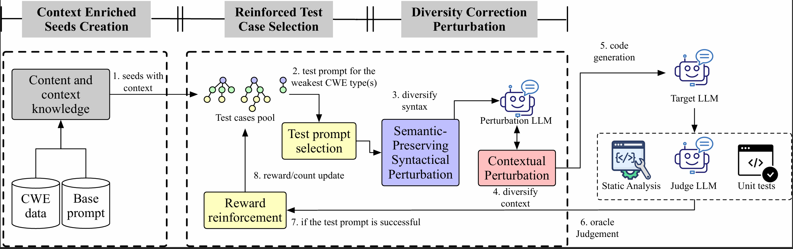

# SecAware

This repository contains the code and released experiment artifacts for:

> SecAware: Awareness Reinforced Security Testing for LLM-based Code Generation

SecAware is an automated testing framework for evaluating whether LLM-based code generation produces functionally correct but insecure code. It mutates natural-language task prompts and uses CWE-grounded feedback to search for prompts that expose model-specific secure-code weaknesses.

## Overview

Large language models can generate useful code from natural-language task prompts, but the generated code may still contain severe security vulnerabilities. Existing security benchmarks for code-generation LLMs are usually static: they cover fixed prompt sets, limited CWE types, and cannot adapt to the weakness profile of a target model.

SecAware addresses this by combining three awareness levels:

- **Context awareness**: distills CWE knowledge and seed prompts into structured security context for prompt mutation.
- **Weakness awareness**: uses MCTS-CWE to reinforce prompts that expose difficult CWE types for the current target LLM.
- **Diversity-correctness awareness**: perturbs prompts through bi-level syntactic and contextual mutations while preserving functional requirements.

The paper evaluates SecAware on six representative LLMs and compares it with two static benchmarks and three automated prompt-generation baselines. SecAware achieves up to **3.34x** higher attack success rate (ASR) while maintaining high prompt realism.

## Method



_Figure: The overall framework of SecAware._

## Code Structure

- `code/datasets/`: CWE knowledge, coding templates, and the initial seed pool.
- `code/fuzzer/`: SecAware fuzzing loop, mutation logic, and selection policies.
- `code/llm/`: target, mutator, and backend wrappers for local, API, Ollama, and vLLM deployments.
- `code/utils/`: oracle, sandbox, prompt templates, vulnerability analysis, and functional validation utilities.
- `RQs/`: released raw experiment outputs for the reported RQ studies.
- `requirements.txt`: Python dependencies.

## Evaluated LLMs

| Model | Size | Type | Vendor |
| --- | --- | --- | --- |
| CodeLlama | 7B | Code specific | Meta |
| DeepSeek-Coder | 33B | Code specific | DeepSeek |
| Llama 3 | 8B | General | Meta |
| Mistral | 7B | General | Mistral AI |
| Phi-4 | 8B | General | Microsoft |
| Qwen2.5-Coder | 32B | Code specific | Alibaba |

The paper uses GLM-4.7 as the perturbation LLM and Qwen3-Max as the judge LLM. Target LLMs can be served through local deployment, Ollama, API backends, or vLLM-compatible OpenAI-style servers.

## Experimental Setup

The paper uses the following core setup:

- Target generation: temperature `0.2`, top-p `0.95`, max generation length `4096`.
- Perturbation generation: GLM-4.7 with temperature `0.7`.
- Judge LLM: Qwen3-Max with temperature `0`.
- Query budget: `1000` per run.
- Repeats: `10` runs for each experiment.
- Metrics: Attack Success Rate (ASR), number of successful test prompts (`Ns`), and Realistic Ratio (RR).
- Statistical validation: Scott-Knott ESD for multiple comparisons; Wilcoxon rank-sum and A12 effect size for pairwise comparisons.

A generated prompt is counted as successful only when the target LLM output is functionally correct and contains a detected CWE vulnerability.

## Compared Methods

### Static Benchmarks

- [LLMSecEval](https://github.com/tuhh-softsec/LLMSecEval): 120 test prompts used in the paper's RQ1 comparison.
- [CyberSecEval](https://github.com/meta-llama/PurpleLlama/tree/main/CybersecurityBenchmarks): 1,916 test prompts used in the paper's RQ1 comparison.

### Automated Baselines

- Random Search: randomly selects mutation operators from SecAware.
- [LLM-Fuzzer / GPTFuzz](https://github.com/sherdencooper/GPTFuzz): adapted from jailbreak-oriented prompt fuzzing to code-generation security testing.
- [EvoPrompt](https://github.com/beeevita/EvoPrompt): adapted from LLM robustness optimization by changing the fitness objective to secure-code testing with LLM-as-a-judge.

## Main Results

### RQ1: Effectiveness

RQ1 asks how effective SecAware is compared with existing benchmarks and automated methods.

In the paper, SecAware ranks first on ASR across all six target LLMs. On average, SecAware reaches:

| Method | Average ASR (%) | Average `Ns` | Average RR (%) |
| --- | ---: | ---: | ---: |
| LLMSecEval | 24.8 | 8.9 | 100.0 |
| CyberSecEval | 24.9 | 10.8 | 100.0 |
| Random Search | 65.0 | 108.7 | 98.8 |
| LLM-Fuzzer | 23.4 | 13.5 | 99.8 |
| EvoPrompt | 24.0 | 14.7 | 100.0 |
| SecAware | 82.8 | 169.8 | 99.1 |

The paper concludes that SecAware improves testing effectiveness and efficiency while keeping generated prompts realistic.

### RQ2: Ablation Study

RQ2 asks how each awareness level contributes to SecAware.

The paper reports four ablation variants:

- `SecAware-w/o-C`: removes CWE knowledge from context awareness.
- `SecAware-w/o-W1`: replaces MCTS-CWE with standard UCB-based MCTS.
- `SecAware-w/o-W2`: keeps the stochastic selection process but removes CWE-type reward.
- `SecAware-w/o-D`: replaces bi-level diversity-correctness perturbation with single-level operator selection.

Average results over all LLMs:

| Approach | ASR (%) | `Ns` | RR (%) |
| --- | ---: | ---: | ---: |
| SecAware-w/o-C | 63.9 | 148.5 | 99.6 |
| SecAware-w/o-W1 | 59.8 | 95.2 | 99.2 |
| SecAware-w/o-W2 | 78.9 | 143.0 | 99.7 |
| SecAware-w/o-D | 49.9 | 91.5 | 99.95 |
| SecAware | 82.8 | 169.8 | 99.90 |

The code exposes ablation switches such as `no_cwe`, `no_operators`, and `no_anchors`; these are implementation-level controls. The paper reports them using the conceptual variants above.

### RQ3: CWE Sensitivity

RQ3 asks which CWE types each LLM is most sensitive to.

The paper reports that LLMs have model-specific vulnerability profiles. Memory-related weaknesses such as CWE-120 and CWE-787 are prominent for CodeLlama, Llama 3, and Phi-4, while command-, database-, and path-related weaknesses such as CWE-78, CWE-89, and CWE-22 are more prominent for DeepSeek-Coder, Mistral, and Qwen2.5-Coder.

The main takeaway is that there is no single universally weakest or strongest CWE type across all LLMs. Adaptive, model-aware testing is therefore more useful than a fixed prompt benchmark.

### RQ4: Repair Guidance

RQ4 asks whether the vulnerability information produced by SecAware helps repair insecure generations.

The paper evaluates two repair strategies on successful SecAware prompts:

- Zero-shot broad instruction: appends a plain security instruction.
- Few-shot CWE-specific guidance: provides CWE-specific secure and insecure examples.

Average repair outcomes:

| Repair Strategy | Fixed (%) | Still Insecure (%) | Functionally Incorrect (%) |
| --- | ---: | ---: | ---: |
| Zero-shot broad instruction | 41.1 | 37.4 | 21.5 |
| Few-shot CWE-specific guidance | 64.2 | 18.6 | 17.1 |

The paper concludes that SecAware's vulnerability information is useful for repair, especially when used as detailed CWE-specific few-shot guidance.

## Quick Start

Install dependencies:

```bash
pip install -r requirements.txt
```

Run SecAware from the `code` directory:

```bash
cd ./code
bash run_secaware.sh
```

You can also invoke the main runner directly:

```bash
cd ./code
python run_secaware.py \
  --target_backend vllm_server \
  --target_model Qwen2.5-Coder-32B-Instruct \
  --vllm_server_url http://localhost:8000/v1 \
  --select_policy mcts_cwe \
  --ablation_config full \
  --max_query 1000
```

Example vLLM server:

```bash
CUDA_VISIBLE_DEVICES=0,1 python -m vllm.entrypoints.openai.api_server \
  --model ./Qwen2.5-Coder-32B-Instruct/ \
  --tensor-parallel-size 2 \
  --port 8000
```

## Important Arguments

- `--target_backend`: target LLM backend (`vllm_server`, `ollama`, `local`, or `qwen`).
- `--target_model`: target model name or local path.
- `--vllm_server_url`: vLLM-compatible endpoint for `vllm_server`.
- `--model_path`: perturbation LLM name or path.
- `--api_key`: API key for the perturbation LLM.
- `--dashscope_api_key`: API key for judge/oracle verification.
- `--select_policy`: selection policy (`mcts_cwe`, `mcts_normalized`, `ucb`, `mcts`, or `random`).
- `--ablation_config`: implementation ablation preset (`full`, `no_anchors`, `no_cwe`, `no_operators`, `no_anchors_no_cwe`, `minimal`, and related presets).
- `--max_query`: maximum query budget.
- `--enable_realistic_analysis`: enables RR analysis during fuzzing.

## Reproducing RQ Experiments

### RQ1

Run SecAware with `--select_policy mcts_cwe`, `--ablation_config full`, and `--max_query 1000` for each target LLM. Baseline outputs released with the repository are stored under `RQs/RQ1/`.

### RQ2

Run the ablation script or the main runner with different implementation switches:

```bash
cd ./code
bash run_ablastion.sh
```

or:

```bash
python run_secaware.py \
  --target_backend vllm_server \
  --target_model llama3-8B-instruct/ \
  --vllm_server_url http://localhost:8001/v1 \
  --select_policy mcts_cwe \
  --ablation_config no_cwe \
  --max_query 1000
```

Released RQ2 outputs are stored under `RQs/RQ2/`.

### RQ3

Aggregate successful SecAware prompts from RQ1 by target LLM and detected CWE type, then compute top and bottom CWE types by ASR. The paper reports this analysis in Figure 9.

### RQ4

Start from successful SecAware prompts in RQ1 and regenerate code with either broad zero-shot security instruction or CWE-specific few-shot guidance. The paper reports this analysis in Figure 10.

## Citation

If you use this repository, please cite the paper:

```bibtex
@article{wu2026secaware,
  title={SecAware: Awareness Reinforced Security Testing for LLM-based Code Generation},
  author={Wu, Siyu and Chen, Tao},
  journal={IEEE Transactions on Software Engineering},
  year={2026}
}
```

## Acknowledgment

This project builds on and compares with prior work including [GPTFuzz](https://github.com/sherdencooper/GPTFuzz), [PurpleLlama CyberSecEval](https://github.com/meta-llama/PurpleLlama), and [EvoPrompt](https://github.com/beeevita/EvoPrompt).
